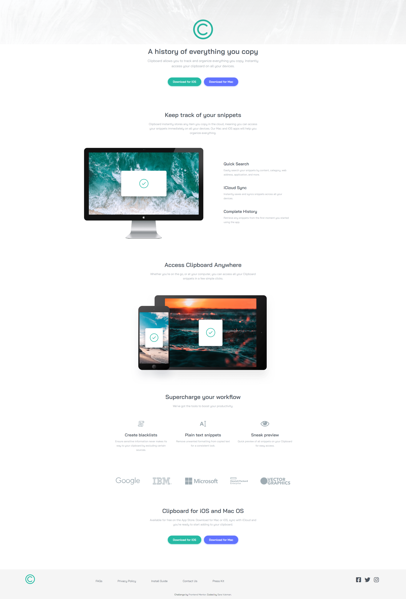

# Frontend Mentor - Clipboard landing page solution

This is a solution to the [Clipboard landing page challenge on Frontend Mentor](https://www.frontendmentor.io/challenges/clipboard-landing-page-5cc9bccd6c4c91111378ecb9). Frontend Mentor challenges help you improve your coding skills by building realistic projects. 

## Table of contents

- [Overview](#overview)
  - [The challenge](#the-challenge)
  - [Screenshot](#screenshot)
  - [Links](#links)
- [My process](#my-process)
  - [Built with](#built-with)
  - [What I learned](#what-i-learned)
  - [Continued development](#continued-development)
  - [Useful resources](#useful-resources)
- [Author](#author)
- [Acknowledgments](#acknowledgments)

## Overview

### The challenge

Users should be able to:

- View the optimal layout for the site depending on their device's screen size
- See hover states for all interactive elements on the page

### Screenshot

### Links

- Solution URL: [https://github.com/Sammbra/Clipboard-landing-page](https://github.com/Sammbra/Clipboard-landing-page)
- Live Site URL: [https://admiring-pike-f1a98d.netlify.app/](https://admiring-pike-f1a98d.netlify.app/)

## My process

### Built with

- Semantic HTML5 markup
- CSS custom properties
- Flexbox
- CSS Grid
- Desktop-first workflow

### What I learned

I learned that I can't change color to images with the same code as I would change color to icons.

### Continued development

I would put another container class with a different name and put different value to max-width because in desktop version the sections are different width. That would make things easier and faster.

### Useful resources

- [Box-shadows](https://getcssscan.com/css-box-shadow-examples) - This website has nice box-shadow examples.
- [Fontawesome](https://fontawesome.com/) - My favorite icons website.

## Author

- Frontend Mentor - [@Sammbra](https://www.frontendmentor.io/profile/Sammbra)

